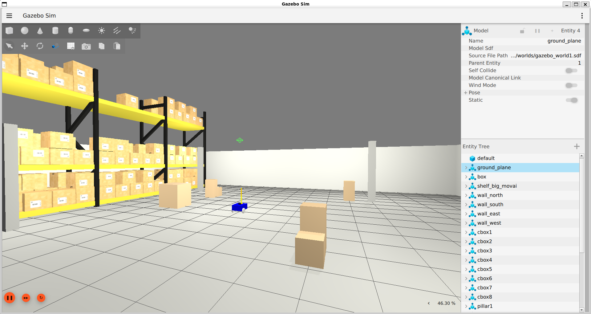
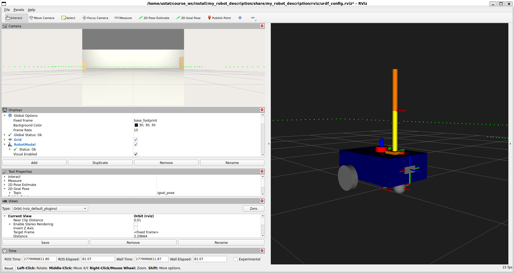
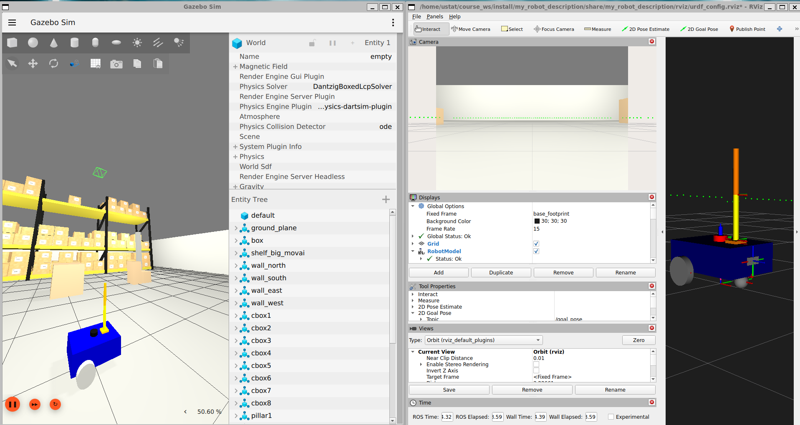

# ROS2 Multi-Sensor Warehouse Robot Simulation

A **ROS2 Jazzy** + **Gazebo Harmonic** robot simulation featuring a 
multi-sensor setup with **Camera**, **LiDAR**, and **IMU**, deployed 
in a **warehouse environment** with real-time **RViz2** visualization.

---

## 🖥️ Simulation Preview

### Warehouse Environment (Gazebo Harmonic)


### Multi-Sensor RViz2 Dashboard


### Full Simulation Overview

---

## 🤖 Project Overview

This project simulates a mobile robot with a 2-DOF robotic arm inside 
a warehouse environment. The robot is equipped with three sensors whose 
data is visualized live in a custom RViz2 dashboard.

This is an upgrade of the original single-camera robot project, now 
featuring full sensor fusion visualization.

---

## ✨ Features

- 📷 **Camera Sensor** — Live image feed visualized in RViz2
- 📡 **LiDAR Sensor** — 360° laser scan at 10Hz, 12m range, visualized as green point cloud
- 📐 **IMU Sensor** — Orientation and acceleration data at 50Hz
- 🏭 **Warehouse World** — Enclosed environment with walls, shelves, cardboard boxes and pillars
- 🖥️ **RViz2 Dashboard** — All three sensors visualized simultaneously
- 🦾 **Robotic Arm** — 2-DOF arm with position control
- 🛞 **Differential Drive** — Keyboard teleoperation via /cmd_vel

---

## 📂 Repository Structure
ROS2_My_Robot_Gazebo/
│
├── src/
│   ├── my_robot_description/       # URDF / XACRO robot model
│   │   ├── urdf/
│   │   │   ├── my_robot.urdf.xacro         # Main robot file
│   │   │   ├── mobile_base.urdf.xacro      # Base + wheels
│   │   │   ├── mobile_base_gazebo.urdf.xacro
│   │   │   ├── arm.urdf.xacro              # Robotic arm
│   │   │   ├── arm_gazebo.urdf.xacro
│   │   │   ├── camera.urdf.xacro           # Camera sensor
│   │   │   ├── lidar.urdf.xacro            # LiDAR sensor (NEW)
│   │   │   ├── imu.urdf.xacro              # IMU sensor (NEW)
│   │   │   └── common_properties.urdf.xacro
│   │   └── rviz/
│   │       └── urdf_config.rviz            # RViz2 dashboard config
│   └── my_robot_bringup/           # Launch files
│       ├── launch/
│       │   └── my_robot_gazebo.launch.xml
│       ├── config/
│       │   └── gazebo_bridge.yaml          # Sensor topic bridges
│       └── worlds/
│           └── gazebo_world1.sdf           # Warehouse world
│
├── .gitignore
├── README.md
└── LICENSE

---

## 🚀 System Requirements

- **Ubuntu 24.04 (Noble Numbat)**
- **ROS2 Jazzy Jalisco**
- **Gazebo Harmonic**
- **RViz2**
- **colcon**
- **xacro**

---

## 🛠️ Installation & Setup

### 1️⃣ Install ROS2 Jazzy
```bash
# Follow official guide
https://docs.ros.org/en/jazzy/Installation.html
```

### 2️⃣ Install Gazebo Harmonic
```bash
sudo apt install gz-harmonic
```

### 3️⃣ Install dependencies
```bash
sudo apt install python3-colcon-common-extensions python3-rosdep
sudo apt install ros-jazzy-ros-gz-bridge ros-jazzy-ros-gz-sim
sudo apt install ros-jazzy-rviz-imu-plugin
sudo rosdep init && rosdep update
```

### 4️⃣ Clone and Build
```bash
git clone https://github.com/USTAT19/ROS2_My_Robot_Gazebo.git
cd ROS2_My_Robot_Gazebo
rosdep install --from-paths src --ignore-src -r -y
colcon build
source install/setup.bash
```

---

## ▶️ Run the Simulation

```bash
ros2 launch my_robot_bringup my_robot_gazebo.launch.xml
```

---

## 🎮 Teleoperation

In a new terminal:
```bash
source install/setup.bash
ros2 run teleop_twist_keyboard teleop_twist_keyboard
```

| Key | Action |
|-----|--------|
| `i` | Forward |
| `,` | Backward |
| `j` | Turn Left |
| `l` | Turn Right |
| `k` | Stop |

---

## 📡 Sensor Topics

| Sensor | Topic | Message Type | Rate |
|--------|-------|-------------|------|
| Camera | /camera/image_raw | sensor_msgs/Image | 10Hz |
| LiDAR | /lidar/scan | sensor_msgs/LaserScan | 5Hz |
| IMU | /imu/data | sensor_msgs/Imu | 50Hz |

---

## 🦾 Arm Control

```bash
# Joint 0 (forearm)
ros2 topic pub -1 /joint0/cmd_pos std_msgs/msg/Float64 "{data: 0.8}"

# Joint 1 (hand)
ros2 topic pub -1 /joint1/cmd_pos std_msgs/msg/Float64 "{data: 0.5}"
```

---

## 🔌 Gazebo Plugins Used

| Plugin | Purpose |
|--------|---------|
| gz::sim::systems::DiffDrive | Differential drive for mobile base |
| gz::sim::systems::JointPositionController | Arm joint control |
| gz::sim::systems::JointStatePublisher | Joint state publishing |
| gz::sim::systems::Sensors | Camera and LiDAR rendering |
| gz::sim::systems::Imu | IMU data publishing |

---

## ⚠️ Notes

- Always source the workspace before running launch files
- Gazebo Harmonic plugins must be compatible with ROS2 Jazzy
- On WSL2, reduce sensor update rates if RViz2 becomes unresponsive

---

## 📄 License

MIT License — free to use, modify and distribute with attribution.
